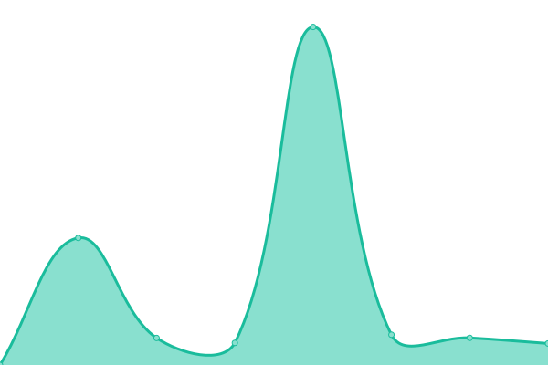

# [📈 Live Status](https://chrimbo.github.io/upptime): <!--live status--> **🟧 Partial outage**

This repository contains the open-source uptime monitor and status page for [chrimbo](https://chrimbo.github.io/upptime), powered by [Upptime](https://github.com/upptime/upptime).

With [Upptime](https://upptime.js.org), you can get your own unlimited and free uptime monitor and status page, powered entirely by a GitHub repository. We use [Issues](https://github.com/chrimbo/upptime/issues) as incident reports, [Actions](https://github.com/chrimbo/upptime/actions) as uptime monitors, and [Pages](https://chrimbo.github.io/upptime) for the status page.

<!--start: status pages-->
<!-- This summary is generated by Upptime (https://github.com/upptime/upptime) -->
<!-- Do not edit this manually, your changes will be overwritten -->

| URL                                  | Status  | History                                                                                    | Response Time                                                                    | Uptime                                                                                                                                                                                                              |
| ------------------------------------ | ------- | ------------------------------------------------------------------------------------------ | -------------------------------------------------------------------------------- | ------------------------------------------------------------------------------------------------------------------------------------------------------------------------------------------------------------------- |
| [Chrimbo.de](https://www.chrimbo.de) | 🟥 Down | [chrimbo-de.yml](https://github.com/chrimbo/upptime/commits/master/history/chrimbo-de.yml) |  3988ms |  |
| [Bormann](https://www.bormann2.de)   | 🟩 Up   | [bormann.yml](https://github.com/chrimbo/upptime/commits/master/history/bormann.yml)       |  4078ms    |        |

<!--end: status pages-->

[**Visit our status website →**](https://chrimbo.github.io/upptime)

## 📄 License

- Code: [MIT](./LICENSE) © [chrimbo](https://chrimbo.github.io/upptime)
- Data in the `./history` directory: [Open Database License](https://opendatacommons.org/licenses/odbl/1-0/)
